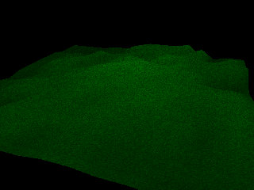



## Basic Direct3D Terrain Engine

### Description

This is a basic Direct3D terrain engine I created

using my 3D engine and well.. I hope you enjoy

it although it may be rather slow on older systems. Please comment & vote.
 
### More Info
 

             |
---                |---
**Submitted On**   |2003-09-11 19:05:10
**By**             |[Jimmy Kelly](https://github.com/Planet-Source-Code/PSCIndex/blob/master/ByAuthor/jimmy-kelly.md)
**Level**          |Advanced
**User Rating**    |4.7 (14 globes from 3 users)
**Compatibility**  |VB 6\.0
**Category**       |[DirectX](https://github.com/Planet-Source-Code/PSCIndex/blob/master/ByCategory/directx__1-44.md)
**World**          |[Visual Basic](https://github.com/Planet-Source-Code/PSCIndex/blob/master/ByWorld/visual-basic.md)
**Archive File**   |[Basic\_Dire1644439112003\.zip](https://github.com/Planet-Source-Code/jimmy-kelly-basic-direct3d-terrain-engine__1-48426/archive/master.zip)

